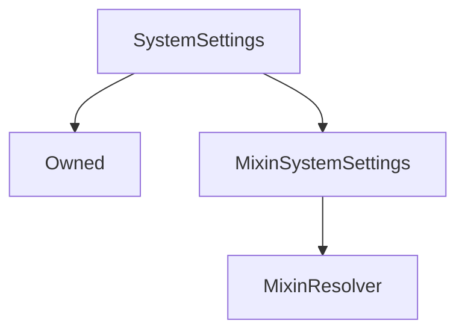

# SystemSettings

## Description

**Source:** [contracts/SystemSettings.sol](https://github.com/Synthetixio/synthetix/tree/v2.37.0/contracts/SystemSettings.sol)

## Architecture

### Libraries

- [SafeMath](/contracts/source/libraries/SafeMath) for `uint`
- [SafeDecimalMath](/contracts/source/libraries/SafeDecimalMath) for `uint`

### Inheritance Graph

## Constants

### `MAX_CROSS_DOMAIN_GAS_LIMIT`

[Source](https://github.com/Synthetixio/synthetix/tree/v2.37.0/contracts/SystemSettings.sol#L42)

**Type:** `uint256`

### `MAX_EXCHANGE_FEE_RATE`

[Source](https://github.com/Synthetixio/synthetix/tree/v2.37.0/contracts/SystemSettings.sol#L37)

**Type:** `uint256`

### `MAX_FEE_PERIOD_DURATION`

[Source](https://github.com/Synthetixio/synthetix/tree/v2.37.0/contracts/SystemSettings.sol#L23)

**Type:** `uint256`

### `MAX_ISSUANCE_RATIO`

[Source](https://github.com/Synthetixio/synthetix/tree/v2.37.0/contracts/SystemSettings.sol#L19)

**Type:** `uint256`

### `MAX_LIQUIDATION_DELAY`

[Source](https://github.com/Synthetixio/synthetix/tree/v2.37.0/contracts/SystemSettings.sol#L33)

**Type:** `uint256`

### `MAX_LIQUIDATION_PENALTY`

[Source](https://github.com/Synthetixio/synthetix/tree/v2.37.0/contracts/SystemSettings.sol#L29)

**Type:** `uint256`

### `MAX_LIQUIDATION_RATIO`

[Source](https://github.com/Synthetixio/synthetix/tree/v2.37.0/contracts/SystemSettings.sol#L27)

**Type:** `uint256`

### `MAX_MINIMUM_STAKE_TIME`

[Source](https://github.com/Synthetixio/synthetix/tree/v2.37.0/contracts/SystemSettings.sol#L40)

**Type:** `uint256`

### `MAX_TARGET_THRESHOLD`

[Source](https://github.com/Synthetixio/synthetix/tree/v2.37.0/contracts/SystemSettings.sol#L25)

**Type:** `uint256`

### `MIN_CROSS_DOMAIN_GAS_LIMIT`

[Source](https://github.com/Synthetixio/synthetix/tree/v2.37.0/contracts/SystemSettings.sol#L43)

**Type:** `uint256`

### `MIN_FEE_PERIOD_DURATION`

[Source](https://github.com/Synthetixio/synthetix/tree/v2.37.0/contracts/SystemSettings.sol#L22)

**Type:** `uint256`

### `MIN_LIQUIDATION_DELAY`

[Source](https://github.com/Synthetixio/synthetix/tree/v2.37.0/contracts/SystemSettings.sol#L34)

**Type:** `uint256`

### `RATIO_FROM_TARGET_BUFFER`

[Source](https://github.com/Synthetixio/synthetix/tree/v2.37.0/contracts/SystemSettings.sol#L31)

**Type:** `uint256`

## Constructor

### `constructor`

[Source](https://github.com/Synthetixio/synthetix/tree/v2.37.0/contracts/SystemSettings.sol#L45)

??? example "Details"

    **Signature**

    `(address _owner, address _resolver)`

    **Visibility**

    `public`

    **State Mutability**

    `nonpayable`

## Views

### `aggregatorWarningFlags`

[Source](https://github.com/Synthetixio/synthetix/tree/v2.37.0/contracts/SystemSettings.sol#L118)

??? example "Details"

    **Signature**

    `aggregatorWarningFlags() returns (address)`

    **Visibility**

    `external`

    **State Mutability**

    `view`

### `crossDomainMessageGasLimit`

[Source](https://github.com/Synthetixio/synthetix/tree/v2.37.0/contracts/SystemSettings.sol#L128)

??? example "Details"

    **Signature**

    `crossDomainMessageGasLimit(enum MixinSystemSettings.CrossDomainMessageGasLimits gasLimitType) returns (uint256)`

    **Visibility**

    `external`

    **State Mutability**

    `view`

### `debtSnapshotStaleTime`

[Source](https://github.com/Synthetixio/synthetix/tree/v2.37.0/contracts/SystemSettings.sol#L114)

??? example "Details"

    **Signature**

    `debtSnapshotStaleTime() returns (uint256)`

    **Visibility**

    `external`

    **State Mutability**

    `view`

### `exchangeFeeRate`

[Source](https://github.com/Synthetixio/synthetix/tree/v2.37.0/contracts/SystemSettings.sol#L106)

??? example "Details"

    **Signature**

    `exchangeFeeRate(bytes32 currencyKey) returns (uint256)`

    **Visibility**

    `external`

    **State Mutability**

    `view`

### `feePeriodDuration`

[Source](https://github.com/Synthetixio/synthetix/tree/v2.37.0/contracts/SystemSettings.sol#L73)

??? example "Details"

    **Signature**

    `feePeriodDuration() returns (uint256)`

    **Visibility**

    `external`

    **State Mutability**

    `view`

### `issuanceRatio`

[Source](https://github.com/Synthetixio/synthetix/tree/v2.37.0/contracts/SystemSettings.sol#L65)

??? example "Details"

    **Signature**

    `issuanceRatio() returns (uint256)`

    **Visibility**

    `external`

    **State Mutability**

    `view`

### `liquidationDelay`

[Source](https://github.com/Synthetixio/synthetix/tree/v2.37.0/contracts/SystemSettings.sol#L84)

??? example "Details"

    **Signature**

    `liquidationDelay() returns (uint256)`

    **Visibility**

    `external`

    **State Mutability**

    `view`

### `liquidationPenalty`

[Source](https://github.com/Synthetixio/synthetix/tree/v2.37.0/contracts/SystemSettings.sol#L97)

??? example "Details"

    **Signature**

    `liquidationPenalty() returns (uint256)`

    **Visibility**

    `external`

    **State Mutability**

    `view`

### `liquidationRatio`

[Source](https://github.com/Synthetixio/synthetix/tree/v2.37.0/contracts/SystemSettings.sol#L91)

??? example "Details"

    **Signature**

    `liquidationRatio() returns (uint256)`

    **Visibility**

    `external`

    **State Mutability**

    `view`

### `minimumStakeTime`

[Source](https://github.com/Synthetixio/synthetix/tree/v2.37.0/contracts/SystemSettings.sol#L110)

??? example "Details"

    **Signature**

    `minimumStakeTime() returns (uint256)`

    **Visibility**

    `external`

    **State Mutability**

    `view`

### `priceDeviationThresholdFactor`

[Source](https://github.com/Synthetixio/synthetix/tree/v2.37.0/contracts/SystemSettings.sol#L59)

??? example "Details"

    **Signature**

    `priceDeviationThresholdFactor() returns (uint256)`

    **Visibility**

    `external`

    **State Mutability**

    `view`

### `rateStalePeriod`

[Source](https://github.com/Synthetixio/synthetix/tree/v2.37.0/contracts/SystemSettings.sol#L102)

??? example "Details"

    **Signature**

    `rateStalePeriod() returns (uint256)`

    **Visibility**

    `external`

    **State Mutability**

    `view`

### `targetThreshold`

[Source](https://github.com/Synthetixio/synthetix/tree/v2.37.0/contracts/SystemSettings.sol#L78)

??? example "Details"

    **Signature**

    `targetThreshold() returns (uint256)`

    **Visibility**

    `external`

    **State Mutability**

    `view`

### `tradingRewardsEnabled`

[Source](https://github.com/Synthetixio/synthetix/tree/v2.37.0/contracts/SystemSettings.sol#L124)

??? example "Details"

    **Signature**

    `tradingRewardsEnabled() returns (bool)`

    **Visibility**

    `external`

    **State Mutability**

    `view`

### `waitingPeriodSecs`

[Source](https://github.com/Synthetixio/synthetix/tree/v2.37.0/contracts/SystemSettings.sol#L52)

??? example "Details"

    **Signature**

    `waitingPeriodSecs() returns (uint256)`

    **Visibility**

    `external`

    **State Mutability**

    `view`

## Restricted Functions

### `setAggregatorWarningFlags`

[Source](https://github.com/Synthetixio/synthetix/tree/v2.37.0/contracts/SystemSettings.sol#L263)

??? example "Details"

    **Signature**

    `setAggregatorWarningFlags(address _flags)`

    **Visibility**

    `external`

    **State Mutability**

    `nonpayable`

    **Requires**

    * [require(..., Valid address must be given)](https://github.com/Synthetixio/synthetix/tree/v2.37.0/contracts/SystemSettings.sol#L264)

    **Modifiers**

    * [onlyOwner](#onlyowner)

    **Emits**

    * [AggregatorWarningFlagsUpdated](#aggregatorwarningflagsupdated)

### `setCrossDomainMessageGasLimit`

[Source](https://github.com/Synthetixio/synthetix/tree/v2.37.0/contracts/SystemSettings.sol#L134)

??? example "Details"

    **Signature**

    `setCrossDomainMessageGasLimit(enum MixinSystemSettings.CrossDomainMessageGasLimits _gasLimitType, uint256 _crossDomainMessageGasLimit)`

    **Visibility**

    `external`

    **State Mutability**

    `nonpayable`

    **Requires**

    * [require(..., Out of range xDomain gasLimit)](https://github.com/Synthetixio/synthetix/tree/v2.37.0/contracts/SystemSettings.sol#L138)

    **Modifiers**

    * [onlyOwner](#onlyowner)

    **Emits**

    * [CrossDomainMessageGasLimitChanged](#crossdomainmessagegaslimitchanged)

### `setDebtSnapshotStaleTime`

[Source](https://github.com/Synthetixio/synthetix/tree/v2.37.0/contracts/SystemSettings.sol#L258)

??? example "Details"

    **Signature**

    `setDebtSnapshotStaleTime(uint256 _seconds)`

    **Visibility**

    `external`

    **State Mutability**

    `nonpayable`

    **Modifiers**

    * [onlyOwner](#onlyowner)

    **Emits**

    * [DebtSnapshotStaleTimeUpdated](#debtsnapshotstaletimeupdated)

### `setExchangeFeeRateForSynths`

[Source](https://github.com/Synthetixio/synthetix/tree/v2.37.0/contracts/SystemSettings.sol#L236)

??? example "Details"

    **Signature**

    `setExchangeFeeRateForSynths(bytes32[] synthKeys, uint256[] exchangeFeeRates)`

    **Visibility**

    `external`

    **State Mutability**

    `nonpayable`

    **Requires**

    * [require(..., Array lengths dont match)](https://github.com/Synthetixio/synthetix/tree/v2.37.0/contracts/SystemSettings.sol#L240)

    **Modifiers**

    * [onlyOwner](#onlyowner)

### `setFeePeriodDuration`

[Source](https://github.com/Synthetixio/synthetix/tree/v2.37.0/contracts/SystemSettings.sol#L176)

??? example "Details"

    **Signature**

    `setFeePeriodDuration(uint256 _feePeriodDuration)`

    **Visibility**

    `external`

    **State Mutability**

    `nonpayable`

    **Requires**

    * [require(..., value < MIN_FEE_PERIOD_DURATION)](https://github.com/Synthetixio/synthetix/tree/v2.37.0/contracts/SystemSettings.sol#L177)

    * [require(..., value > MAX_FEE_PERIOD_DURATION)](https://github.com/Synthetixio/synthetix/tree/v2.37.0/contracts/SystemSettings.sol#L178)

    **Modifiers**

    * [onlyOwner](#onlyowner)

    **Emits**

    * [FeePeriodDurationUpdated](#feeperioddurationupdated)

### `setIssuanceRatio`

[Source](https://github.com/Synthetixio/synthetix/tree/v2.37.0/contracts/SystemSettings.sol#L170)

??? example "Details"

    **Signature**

    `setIssuanceRatio(uint256 _issuanceRatio)`

    **Visibility**

    `external`

    **State Mutability**

    `nonpayable`

    **Requires**

    * [require(..., New issuance ratio cannot exceed MAX_ISSUANCE_RATIO)](https://github.com/Synthetixio/synthetix/tree/v2.37.0/contracts/SystemSettings.sol#L171)

    **Modifiers**

    * [onlyOwner](#onlyowner)

    **Emits**

    * [IssuanceRatioUpdated](#issuanceratioupdated)

### `setLiquidationDelay`

[Source](https://github.com/Synthetixio/synthetix/tree/v2.37.0/contracts/SystemSettings.sol#L195)

??? example "Details"

    **Signature**

    `setLiquidationDelay(uint256 time)`

    **Visibility**

    `external`

    **State Mutability**

    `nonpayable`

    **Requires**

    * [require(..., Must be less than 30 days)](https://github.com/Synthetixio/synthetix/tree/v2.37.0/contracts/SystemSettings.sol#L196)

    * [require(..., Must be greater than 1 day)](https://github.com/Synthetixio/synthetix/tree/v2.37.0/contracts/SystemSettings.sol#L197)

    **Modifiers**

    * [onlyOwner](#onlyowner)

    **Emits**

    * [LiquidationDelayUpdated](#liquidationdelayupdated)

### `setLiquidationPenalty`

[Source](https://github.com/Synthetixio/synthetix/tree/v2.37.0/contracts/SystemSettings.sol#L222)

??? example "Details"

    **Signature**

    `setLiquidationPenalty(uint256 penalty)`

    **Visibility**

    `external`

    **State Mutability**

    `nonpayable`

    **Requires**

    * [require(..., penalty > MAX_LIQUIDATION_PENALTY)](https://github.com/Synthetixio/synthetix/tree/v2.37.0/contracts/SystemSettings.sol#L223)

    **Modifiers**

    * [onlyOwner](#onlyowner)

    **Emits**

    * [LiquidationPenaltyUpdated](#liquidationpenaltyupdated)

### `setLiquidationRatio`

[Source](https://github.com/Synthetixio/synthetix/tree/v2.37.0/contracts/SystemSettings.sol#L206)

??? example "Details"

    **Signature**

    `setLiquidationRatio(uint256 _liquidationRatio)`

    **Visibility**

    `external`

    **State Mutability**

    `nonpayable`

    **Requires**

    * [require(..., liquidationRatio > MAX_LIQUIDATION_RATIO / (1 + penalty))](https://github.com/Synthetixio/synthetix/tree/v2.37.0/contracts/SystemSettings.sol#L207)

    * [require(..., liquidationRatio < MIN_LIQUIDATION_RATIO)](https://github.com/Synthetixio/synthetix/tree/v2.37.0/contracts/SystemSettings.sol#L215)

    **Modifiers**

    * [onlyOwner](#onlyowner)

    **Emits**

    * [LiquidationRatioUpdated](#liquidationratioupdated)

### `setMinimumStakeTime`

[Source](https://github.com/Synthetixio/synthetix/tree/v2.37.0/contracts/SystemSettings.sol#L252)

??? example "Details"

    **Signature**

    `setMinimumStakeTime(uint256 _seconds)`

    **Visibility**

    `external`

    **State Mutability**

    `nonpayable`

    **Requires**

    * [require(..., stake time exceed maximum 1 week)](https://github.com/Synthetixio/synthetix/tree/v2.37.0/contracts/SystemSettings.sol#L253)

    **Modifiers**

    * [onlyOwner](#onlyowner)

    **Emits**

    * [MinimumStakeTimeUpdated](#minimumstaketimeupdated)

### `setPriceDeviationThresholdFactor`

[Source](https://github.com/Synthetixio/synthetix/tree/v2.37.0/contracts/SystemSettings.sol#L161)

??? example "Details"

    **Signature**

    `setPriceDeviationThresholdFactor(uint256 _priceDeviationThresholdFactor)`

    **Visibility**

    `external`

    **State Mutability**

    `nonpayable`

    **Modifiers**

    * [onlyOwner](#onlyowner)

    **Emits**

    * [PriceDeviationThresholdUpdated](#pricedeviationthresholdupdated)

### `setRateStalePeriod`

[Source](https://github.com/Synthetixio/synthetix/tree/v2.37.0/contracts/SystemSettings.sol#L230)

??? example "Details"

    **Signature**

    `setRateStalePeriod(uint256 period)`

    **Visibility**

    `external`

    **State Mutability**

    `nonpayable`

    **Modifiers**

    * [onlyOwner](#onlyowner)

    **Emits**

    * [RateStalePeriodUpdated](#ratestaleperiodupdated)

### `setTargetThreshold`

[Source](https://github.com/Synthetixio/synthetix/tree/v2.37.0/contracts/SystemSettings.sol#L185)

??? example "Details"

    **Signature**

    `setTargetThreshold(uint256 _percent)`

    **Visibility**

    `external`

    **State Mutability**

    `nonpayable`

    **Requires**

    * [require(..., Threshold too high)](https://github.com/Synthetixio/synthetix/tree/v2.37.0/contracts/SystemSettings.sol#L186)

    **Modifiers**

    * [onlyOwner](#onlyowner)

    **Emits**

    * [TargetThresholdUpdated](#targetthresholdupdated)

### `setTradingRewardsEnabled`

[Source](https://github.com/Synthetixio/synthetix/tree/v2.37.0/contracts/SystemSettings.sol#L151)

??? example "Details"

    **Signature**

    `setTradingRewardsEnabled(bool _tradingRewardsEnabled)`

    **Visibility**

    `external`

    **State Mutability**

    `nonpayable`

    **Modifiers**

    * [onlyOwner](#onlyowner)

    **Emits**

    * [TradingRewardsEnabled](#tradingrewardsenabled)

### `setWaitingPeriodSecs`

[Source](https://github.com/Synthetixio/synthetix/tree/v2.37.0/contracts/SystemSettings.sol#L156)

??? example "Details"

    **Signature**

    `setWaitingPeriodSecs(uint256 _waitingPeriodSecs)`

    **Visibility**

    `external`

    **State Mutability**

    `nonpayable`

    **Modifiers**

    * [onlyOwner](#onlyowner)

    **Emits**

    * [WaitingPeriodSecsUpdated](#waitingperiodsecsupdated)

## Events

### `AggregatorWarningFlagsUpdated`

[Source](https://github.com/Synthetixio/synthetix/tree/v2.37.0/contracts/SystemSettings.sol#L284)

**Signature**: `AggregatorWarningFlagsUpdated(address flags)`

### `CrossDomainMessageGasLimitChanged`

[Source](https://github.com/Synthetixio/synthetix/tree/v2.37.0/contracts/SystemSettings.sol#L270)

**Signature**: `CrossDomainMessageGasLimitChanged(enum MixinSystemSettings.CrossDomainMessageGasLimits gasLimitType, uint256 newLimit)`

### `DebtSnapshotStaleTimeUpdated`

[Source](https://github.com/Synthetixio/synthetix/tree/v2.37.0/contracts/SystemSettings.sol#L283)

**Signature**: `DebtSnapshotStaleTimeUpdated(uint256 debtSnapshotStaleTime)`

### `ExchangeFeeUpdated`

[Source](https://github.com/Synthetixio/synthetix/tree/v2.37.0/contracts/SystemSettings.sol#L281)

**Signature**: `ExchangeFeeUpdated(bytes32 synthKey, uint256 newExchangeFeeRate)`

### `FeePeriodDurationUpdated`

[Source](https://github.com/Synthetixio/synthetix/tree/v2.37.0/contracts/SystemSettings.sol#L275)

**Signature**: `FeePeriodDurationUpdated(uint256 newFeePeriodDuration)`

### `IssuanceRatioUpdated`

[Source](https://github.com/Synthetixio/synthetix/tree/v2.37.0/contracts/SystemSettings.sol#L274)

**Signature**: `IssuanceRatioUpdated(uint256 newRatio)`

### `LiquidationDelayUpdated`

[Source](https://github.com/Synthetixio/synthetix/tree/v2.37.0/contracts/SystemSettings.sol#L277)

**Signature**: `LiquidationDelayUpdated(uint256 newDelay)`

### `LiquidationPenaltyUpdated`

[Source](https://github.com/Synthetixio/synthetix/tree/v2.37.0/contracts/SystemSettings.sol#L279)

**Signature**: `LiquidationPenaltyUpdated(uint256 newPenalty)`

### `LiquidationRatioUpdated`

[Source](https://github.com/Synthetixio/synthetix/tree/v2.37.0/contracts/SystemSettings.sol#L278)

**Signature**: `LiquidationRatioUpdated(uint256 newRatio)`

### `MinimumStakeTimeUpdated`

[Source](https://github.com/Synthetixio/synthetix/tree/v2.37.0/contracts/SystemSettings.sol#L282)

**Signature**: `MinimumStakeTimeUpdated(uint256 minimumStakeTime)`

### `PriceDeviationThresholdUpdated`

[Source](https://github.com/Synthetixio/synthetix/tree/v2.37.0/contracts/SystemSettings.sol#L273)

**Signature**: `PriceDeviationThresholdUpdated(uint256 threshold)`

### `RateStalePeriodUpdated`

[Source](https://github.com/Synthetixio/synthetix/tree/v2.37.0/contracts/SystemSettings.sol#L280)

**Signature**: `RateStalePeriodUpdated(uint256 rateStalePeriod)`

### `TargetThresholdUpdated`

[Source](https://github.com/Synthetixio/synthetix/tree/v2.37.0/contracts/SystemSettings.sol#L276)

**Signature**: `TargetThresholdUpdated(uint256 newTargetThreshold)`

### `TradingRewardsEnabled`

[Source](https://github.com/Synthetixio/synthetix/tree/v2.37.0/contracts/SystemSettings.sol#L271)

**Signature**: `TradingRewardsEnabled(bool enabled)`

### `WaitingPeriodSecsUpdated`

[Source](https://github.com/Synthetixio/synthetix/tree/v2.37.0/contracts/SystemSettings.sol#L272)

**Signature**: `WaitingPeriodSecsUpdated(uint256 waitingPeriodSecs)`
