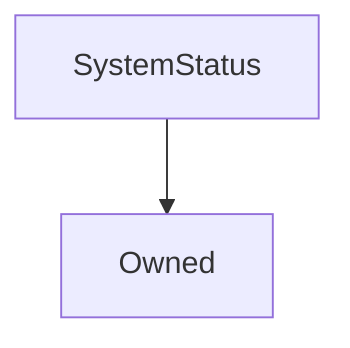

# SystemStatus

## Description

Implemented to address [SIP-44](https://sips.synthetix.io/sips/sip-44) - various mechanisms to suspend the Synthetix system

**Source:** [contracts/SystemStatus.sol](https://github.com/Synthetixio/synthetix/tree/v2.27.2-beta/contracts/SystemStatus.sol)

## Architecture

### Inheritance Graph

## Constants

### `SECTION_EXCHANGE`

[Source](https://github.com/Synthetixio/synthetix/tree/v2.27.2-beta/contracts/SystemStatus.sol#L16)

**Type:** `bytes32`

### `SECTION_ISSUANCE`

[Source](https://github.com/Synthetixio/synthetix/tree/v2.27.2-beta/contracts/SystemStatus.sol#L15)

**Type:** `bytes32`

### `SECTION_SYNTH`

[Source](https://github.com/Synthetixio/synthetix/tree/v2.27.2-beta/contracts/SystemStatus.sol#L17)

**Type:** `bytes32`

### `SECTION_SYSTEM`

[Source](https://github.com/Synthetixio/synthetix/tree/v2.27.2-beta/contracts/SystemStatus.sol#L14)

**Type:** `bytes32`

### `SUSPENSION_REASON_UPGRADE`

[Source](https://github.com/Synthetixio/synthetix/tree/v2.27.2-beta/contracts/SystemStatus.sol#L12)

**Type:** `uint248`

## Variables

### `accessControl`

[Source](https://github.com/Synthetixio/synthetix/tree/v2.27.2-beta/contracts/SystemStatus.sol#L10)

**Type:** `mapping(bytes32 => mapping(address => struct ISystemStatus.Status))`

### `exchangeSuspension`

[Source](https://github.com/Synthetixio/synthetix/tree/v2.27.2-beta/contracts/SystemStatus.sol#L23)

**Type:** `struct ISystemStatus.Suspension`

### `issuanceSuspension`

[Source](https://github.com/Synthetixio/synthetix/tree/v2.27.2-beta/contracts/SystemStatus.sol#L21)

**Type:** `struct ISystemStatus.Suspension`

### `synthSuspension`

[Source](https://github.com/Synthetixio/synthetix/tree/v2.27.2-beta/contracts/SystemStatus.sol#L25)

**Type:** `mapping(bytes32 => struct ISystemStatus.Suspension)`

### `systemSuspension`

[Source](https://github.com/Synthetixio/synthetix/tree/v2.27.2-beta/contracts/SystemStatus.sol#L19)

**Type:** `struct ISystemStatus.Suspension`

## Constructor

### `constructor`

[Source](https://github.com/Synthetixio/synthetix/tree/v2.27.2-beta/contracts/SystemStatus.sol#L27)

??? example "Details"

    **Signature**

    `(address _owner)`

    **Visibility**

    `public`

    **State Mutability**

    `nonpayable`

## Views

### `getSynthSuspensions`

[Source](https://github.com/Synthetixio/synthetix/tree/v2.27.2-beta/contracts/SystemStatus.sol#L71)

??? example "Details"

    **Signature**

    `getSynthSuspensions(bytes32[] synths) returns (bool[], uint256[])`

    **Visibility**

    `external`

    **State Mutability**

    `view`

### `isSystemUpgrading`

[Source](https://github.com/Synthetixio/synthetix/tree/v2.27.2-beta/contracts/SystemStatus.sol#L67)

??? example "Details"

    **Signature**

    `isSystemUpgrading() returns (bool)`

    **Visibility**

    `external`

    **State Mutability**

    `view`

### `requireExchangeActive`

[Source](https://github.com/Synthetixio/synthetix/tree/v2.27.2-beta/contracts/SystemStatus.sol#L45)

??? example "Details"

    **Signature**

    `requireExchangeActive()`

    **Visibility**

    `external`

    **State Mutability**

    `view`

    **Requires**

    * [_internalRequireSystemActive](https://github.com/Synthetixio/synthetix/tree/v2.27.2-beta/contracts/SystemStatus.sol#L47)

    * [require(..., Exchange is suspended. Operation prohibited)](https://github.com/Synthetixio/synthetix/tree/v2.27.2-beta/contracts/SystemStatus.sol#L48)

### `requireIssuanceActive`

[Source](https://github.com/Synthetixio/synthetix/tree/v2.27.2-beta/contracts/SystemStatus.sol#L39)

??? example "Details"

    **Signature**

    `requireIssuanceActive()`

    **Visibility**

    `external`

    **State Mutability**

    `view`

    **Requires**

    * [_internalRequireSystemActive](https://github.com/Synthetixio/synthetix/tree/v2.27.2-beta/contracts/SystemStatus.sol#L41)

    * [require(..., Issuance is suspended. Operation prohibited)](https://github.com/Synthetixio/synthetix/tree/v2.27.2-beta/contracts/SystemStatus.sol#L42)

### `requireSynthActive`

[Source](https://github.com/Synthetixio/synthetix/tree/v2.27.2-beta/contracts/SystemStatus.sol#L51)

??? example "Details"

    **Signature**

    `requireSynthActive(bytes32 currencyKey)`

    **Visibility**

    `external`

    **State Mutability**

    `view`

    **Requires**

    * [_internalRequireSystemActive](https://github.com/Synthetixio/synthetix/tree/v2.27.2-beta/contracts/SystemStatus.sol#L53)

    * [require(..., Synth is suspended. Operation prohibited)](https://github.com/Synthetixio/synthetix/tree/v2.27.2-beta/contracts/SystemStatus.sol#L54)

### `requireSynthsActive`

[Source](https://github.com/Synthetixio/synthetix/tree/v2.27.2-beta/contracts/SystemStatus.sol#L57)

??? example "Details"

    **Signature**

    `requireSynthsActive(bytes32 sourceCurrencyKey, bytes32 destinationCurrencyKey)`

    **Visibility**

    `external`

    **State Mutability**

    `view`

    **Requires**

    * [_internalRequireSystemActive](https://github.com/Synthetixio/synthetix/tree/v2.27.2-beta/contracts/SystemStatus.sol#L59)

    * [require(..., One or more synths are suspended. Operation prohibited)](https://github.com/Synthetixio/synthetix/tree/v2.27.2-beta/contracts/SystemStatus.sol#L61)

### `requireSystemActive`

[Source](https://github.com/Synthetixio/synthetix/tree/v2.27.2-beta/contracts/SystemStatus.sol#L35)

??? example "Details"

    **Signature**

    `requireSystemActive()`

    **Visibility**

    `external`

    **State Mutability**

    `view`

    **Requires**

    * [_internalRequireSystemActive](https://github.com/Synthetixio/synthetix/tree/v2.27.2-beta/contracts/SystemStatus.sol#L36)

## Restricted Functions

### `resumeExchange`

[Source](https://github.com/Synthetixio/synthetix/tree/v2.27.2-beta/contracts/SystemStatus.sol#L130)

??? example "Details"

    **Signature**

    `resumeExchange()`

    **Visibility**

    `external`

    **State Mutability**

    `nonpayable`

    **Requires**

    * [_requireAccessToResume](https://github.com/Synthetixio/synthetix/tree/v2.27.2-beta/contracts/SystemStatus.sol#L131)

    **Emits**

    * [ExchangeResumed](#exchangeresumed)

### `resumeIssuance`

[Source](https://github.com/Synthetixio/synthetix/tree/v2.27.2-beta/contracts/SystemStatus.sol#L116)

??? example "Details"

    **Signature**

    `resumeIssuance()`

    **Visibility**

    `external`

    **State Mutability**

    `nonpayable`

    **Requires**

    * [_requireAccessToResume](https://github.com/Synthetixio/synthetix/tree/v2.27.2-beta/contracts/SystemStatus.sol#L117)

    **Emits**

    * [IssuanceResumed](#issuanceresumed)

### `resumeSynth`

[Source](https://github.com/Synthetixio/synthetix/tree/v2.27.2-beta/contracts/SystemStatus.sol#L144)

??? example "Details"

    **Signature**

    `resumeSynth(bytes32 currencyKey)`

    **Visibility**

    `external`

    **State Mutability**

    `nonpayable`

    **Requires**

    * [_requireAccessToResume](https://github.com/Synthetixio/synthetix/tree/v2.27.2-beta/contracts/SystemStatus.sol#L145)

    **Emits**

    * [SynthResumed](#synthresumed)

### `resumeSystem`

[Source](https://github.com/Synthetixio/synthetix/tree/v2.27.2-beta/contracts/SystemStatus.sol#L102)

??? example "Details"

    **Signature**

    `resumeSystem()`

    **Visibility**

    `external`

    **State Mutability**

    `nonpayable`

    **Requires**

    * [_requireAccessToResume](https://github.com/Synthetixio/synthetix/tree/v2.27.2-beta/contracts/SystemStatus.sol#L103)

    **Emits**

    * [SystemResumed](#systemresumed)

### `suspendExchange`

[Source](https://github.com/Synthetixio/synthetix/tree/v2.27.2-beta/contracts/SystemStatus.sol#L123)

??? example "Details"

    **Signature**

    `suspendExchange(uint256 reason)`

    **Visibility**

    `external`

    **State Mutability**

    `nonpayable`

    **Requires**

    * [_requireAccessToSuspend](https://github.com/Synthetixio/synthetix/tree/v2.27.2-beta/contracts/SystemStatus.sol#L124)

    **Emits**

    * [ExchangeSuspended](#exchangesuspended)

### `suspendIssuance`

[Source](https://github.com/Synthetixio/synthetix/tree/v2.27.2-beta/contracts/SystemStatus.sol#L109)

??? example "Details"

    **Signature**

    `suspendIssuance(uint256 reason)`

    **Visibility**

    `external`

    **State Mutability**

    `nonpayable`

    **Requires**

    * [_requireAccessToSuspend](https://github.com/Synthetixio/synthetix/tree/v2.27.2-beta/contracts/SystemStatus.sol#L110)

    **Emits**

    * [IssuanceSuspended](#issuancesuspended)

### `suspendSynth`

[Source](https://github.com/Synthetixio/synthetix/tree/v2.27.2-beta/contracts/SystemStatus.sol#L137)

??? example "Details"

    **Signature**

    `suspendSynth(bytes32 currencyKey, uint256 reason)`

    **Visibility**

    `external`

    **State Mutability**

    `nonpayable`

    **Requires**

    * [_requireAccessToSuspend](https://github.com/Synthetixio/synthetix/tree/v2.27.2-beta/contracts/SystemStatus.sol#L138)

    **Emits**

    * [SynthSuspended](#synthsuspended)

### `suspendSystem`

[Source](https://github.com/Synthetixio/synthetix/tree/v2.27.2-beta/contracts/SystemStatus.sol#L95)

??? example "Details"

    **Signature**

    `suspendSystem(uint256 reason)`

    **Visibility**

    `external`

    **State Mutability**

    `nonpayable`

    **Requires**

    * [_requireAccessToSuspend](https://github.com/Synthetixio/synthetix/tree/v2.27.2-beta/contracts/SystemStatus.sol#L96)

    **Emits**

    * [SystemSuspended](#systemsuspended)

### `updateAccessControl`

[Source](https://github.com/Synthetixio/synthetix/tree/v2.27.2-beta/contracts/SystemStatus.sol#L86)

??? example "Details"

    **Signature**

    `updateAccessControl(bytes32 section, address account, bool canSuspend, bool canResume)`

    **Visibility**

    `external`

    **State Mutability**

    `nonpayable`

    **Modifiers**

    * [onlyOwner](#onlyowner)

## Internal Functions

### `_internalRequireSystemActive`

[Source](https://github.com/Synthetixio/synthetix/tree/v2.27.2-beta/contracts/SystemStatus.sol#L160)

??? example "Details"

    **Signature**

    `_internalRequireSystemActive()`

    **Visibility**

    `internal`

    **State Mutability**

    `view`

    **Requires**

    * [require(..., memory)](https://github.com/Synthetixio/synthetix/tree/v2.27.2-beta/contracts/SystemStatus.sol#L161)

### `_internalUpdateAccessControl`

[Source](https://github.com/Synthetixio/synthetix/tree/v2.27.2-beta/contracts/SystemStatus.sol#L169)

??? example "Details"

    **Signature**

    `_internalUpdateAccessControl(bytes32 section, address account, bool canSuspend, bool canResume)`

    **Visibility**

    `internal`

    **State Mutability**

    `nonpayable`

    **Requires**

    * [require(..., Invalid section supplied)](https://github.com/Synthetixio/synthetix/tree/v2.27.2-beta/contracts/SystemStatus.sol#L175)

    **Emits**

    * [AccessControlUpdated](#accesscontrolupdated)

### `_requireAccessToResume`

[Source](https://github.com/Synthetixio/synthetix/tree/v2.27.2-beta/contracts/SystemStatus.sol#L156)

??? example "Details"

    **Signature**

    `_requireAccessToResume(bytes32 section)`

    **Visibility**

    `internal`

    **State Mutability**

    `view`

    **Requires**

    * [require(..., Restricted to access control list)](https://github.com/Synthetixio/synthetix/tree/v2.27.2-beta/contracts/SystemStatus.sol#L157)

### `_requireAccessToSuspend`

[Source](https://github.com/Synthetixio/synthetix/tree/v2.27.2-beta/contracts/SystemStatus.sol#L152)

??? example "Details"

    **Signature**

    `_requireAccessToSuspend(bytes32 section)`

    **Visibility**

    `internal`

    **State Mutability**

    `view`

    **Requires**

    * [require(..., Restricted to access control list)](https://github.com/Synthetixio/synthetix/tree/v2.27.2-beta/contracts/SystemStatus.sol#L153)

## Events

### `AccessControlUpdated`

[Source](https://github.com/Synthetixio/synthetix/tree/v2.27.2-beta/contracts/SystemStatus.sol#L201)

**Signature**: `AccessControlUpdated(bytes32 section, address account, bool canSuspend, bool canResume)`

### `ExchangeResumed`

[Source](https://github.com/Synthetixio/synthetix/tree/v2.27.2-beta/contracts/SystemStatus.sol#L196)

**Signature**: `ExchangeResumed(uint256 reason)`

### `ExchangeSuspended`

[Source](https://github.com/Synthetixio/synthetix/tree/v2.27.2-beta/contracts/SystemStatus.sol#L195)

**Signature**: `ExchangeSuspended(uint256 reason)`

### `IssuanceResumed`

[Source](https://github.com/Synthetixio/synthetix/tree/v2.27.2-beta/contracts/SystemStatus.sol#L193)

**Signature**: `IssuanceResumed(uint256 reason)`

### `IssuanceSuspended`

[Source](https://github.com/Synthetixio/synthetix/tree/v2.27.2-beta/contracts/SystemStatus.sol#L192)

**Signature**: `IssuanceSuspended(uint256 reason)`

### `SynthResumed`

[Source](https://github.com/Synthetixio/synthetix/tree/v2.27.2-beta/contracts/SystemStatus.sol#L199)

**Signature**: `SynthResumed(bytes32 currencyKey, uint256 reason)`

### `SynthSuspended`

[Source](https://github.com/Synthetixio/synthetix/tree/v2.27.2-beta/contracts/SystemStatus.sol#L198)

**Signature**: `SynthSuspended(bytes32 currencyKey, uint256 reason)`

### `SystemResumed`

[Source](https://github.com/Synthetixio/synthetix/tree/v2.27.2-beta/contracts/SystemStatus.sol#L190)

**Signature**: `SystemResumed(uint256 reason)`

### `SystemSuspended`

[Source](https://github.com/Synthetixio/synthetix/tree/v2.27.2-beta/contracts/SystemStatus.sol#L189)

**Signature**: `SystemSuspended(uint256 reason)`
