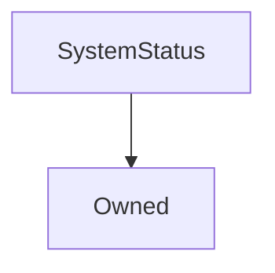

# SystemStatus

## Description

Implemented to address [SIP-44](https://sips.synthetix.io/sips/sip-44) - various mechanisms to suspend the Synthetix system

**Source:** [contracts/SystemStatus.sol](https://github.com/Synthetixio/synthetix/tree/v2.24.0-rc/contracts/SystemStatus.sol)

## Architecture

### Inheritance Graph

## Structs

### `Status`

[Source](https://github.com/Synthetixio/synthetix/tree/v2.24.0-rc/contracts/SystemStatus.sol#L10)

| Field        | Type   | Description |
| ------------ | ------ | ----------- |
| `canSuspend` | `bool` | TBA         |
| `canResume`  | `bool` | TBA         |

### `Suspension`

[Source](https://github.com/Synthetixio/synthetix/tree/v2.24.0-rc/contracts/SystemStatus.sol#L17)

| Field       | Type      | Description |
| ----------- | --------- | ----------- |
| `suspended` | `bool`    | TBA         |
| `reason`    | `uint248` | TBA         |

## Constants

### `SECTION_EXCHANGE`

[Source](https://github.com/Synthetixio/synthetix/tree/v2.24.0-rc/contracts/SystemStatus.sol#L28)

**Type:** `bytes32`

### `SECTION_ISSUANCE`

[Source](https://github.com/Synthetixio/synthetix/tree/v2.24.0-rc/contracts/SystemStatus.sol#L27)

**Type:** `bytes32`

### `SECTION_SYNTH`

[Source](https://github.com/Synthetixio/synthetix/tree/v2.24.0-rc/contracts/SystemStatus.sol#L29)

**Type:** `bytes32`

### `SECTION_SYSTEM`

[Source](https://github.com/Synthetixio/synthetix/tree/v2.24.0-rc/contracts/SystemStatus.sol#L26)

**Type:** `bytes32`

### `SUSPENSION_REASON_UPGRADE`

[Source](https://github.com/Synthetixio/synthetix/tree/v2.24.0-rc/contracts/SystemStatus.sol#L24)

**Type:** `uint248`

## Variables

### `accessControl`

[Source](https://github.com/Synthetixio/synthetix/tree/v2.24.0-rc/contracts/SystemStatus.sol#L15)

**Type:** `mapping(bytes32 => mapping(address => struct SystemStatus.Status))`

### `exchangeSuspension`

[Source](https://github.com/Synthetixio/synthetix/tree/v2.24.0-rc/contracts/SystemStatus.sol#L35)

**Type:** `struct SystemStatus.Suspension`

### `issuanceSuspension`

[Source](https://github.com/Synthetixio/synthetix/tree/v2.24.0-rc/contracts/SystemStatus.sol#L33)

**Type:** `struct SystemStatus.Suspension`

### `synthSuspension`

[Source](https://github.com/Synthetixio/synthetix/tree/v2.24.0-rc/contracts/SystemStatus.sol#L37)

**Type:** `mapping(bytes32 => struct SystemStatus.Suspension)`

### `systemSuspension`

[Source](https://github.com/Synthetixio/synthetix/tree/v2.24.0-rc/contracts/SystemStatus.sol#L31)

**Type:** `struct SystemStatus.Suspension`

## Constructor

### `constructor`

[Source](https://github.com/Synthetixio/synthetix/tree/v2.24.0-rc/contracts/SystemStatus.sol#L39)

??? example "Details"

    **Signature**

    `(address _owner)`

    **Visibility**

    `public`

    **State Mutability**

    `nonpayable`

## Views

### `getSynthSuspensions`

[Source](https://github.com/Synthetixio/synthetix/tree/v2.24.0-rc/contracts/SystemStatus.sol#L83)

??? example "Details"

    **Signature**

    `getSynthSuspensions(bytes32[] synths) returns (bool[], uint256[])`

    **Visibility**

    `external`

    **State Mutability**

    `view`

### `isSystemUpgrading`

[Source](https://github.com/Synthetixio/synthetix/tree/v2.24.0-rc/contracts/SystemStatus.sol#L79)

??? example "Details"

    **Signature**

    `isSystemUpgrading() returns (bool)`

    **Visibility**

    `external`

    **State Mutability**

    `view`

### `requireExchangeActive`

[Source](https://github.com/Synthetixio/synthetix/tree/v2.24.0-rc/contracts/SystemStatus.sol#L57)

??? example "Details"

    **Signature**

    `requireExchangeActive()`

    **Visibility**

    `external`

    **State Mutability**

    `view`

    **Requires**

    * [_internalRequireSystemActive](https://github.com/Synthetixio/synthetix/tree/v2.24.0-rc/contracts/SystemStatus.sol#L59)

    * [require(..., Exchange is suspended. Operation prohibited)](https://github.com/Synthetixio/synthetix/tree/v2.24.0-rc/contracts/SystemStatus.sol#L60)

### `requireIssuanceActive`

[Source](https://github.com/Synthetixio/synthetix/tree/v2.24.0-rc/contracts/SystemStatus.sol#L51)

??? example "Details"

    **Signature**

    `requireIssuanceActive()`

    **Visibility**

    `external`

    **State Mutability**

    `view`

    **Requires**

    * [_internalRequireSystemActive](https://github.com/Synthetixio/synthetix/tree/v2.24.0-rc/contracts/SystemStatus.sol#L53)

    * [require(..., Issuance is suspended. Operation prohibited)](https://github.com/Synthetixio/synthetix/tree/v2.24.0-rc/contracts/SystemStatus.sol#L54)

### `requireSynthActive`

[Source](https://github.com/Synthetixio/synthetix/tree/v2.24.0-rc/contracts/SystemStatus.sol#L63)

??? example "Details"

    **Signature**

    `requireSynthActive(bytes32 currencyKey)`

    **Visibility**

    `external`

    **State Mutability**

    `view`

    **Requires**

    * [_internalRequireSystemActive](https://github.com/Synthetixio/synthetix/tree/v2.24.0-rc/contracts/SystemStatus.sol#L65)

    * [require(..., Synth is suspended. Operation prohibited)](https://github.com/Synthetixio/synthetix/tree/v2.24.0-rc/contracts/SystemStatus.sol#L66)

### `requireSynthsActive`

[Source](https://github.com/Synthetixio/synthetix/tree/v2.24.0-rc/contracts/SystemStatus.sol#L69)

??? example "Details"

    **Signature**

    `requireSynthsActive(bytes32 sourceCurrencyKey, bytes32 destinationCurrencyKey)`

    **Visibility**

    `external`

    **State Mutability**

    `view`

    **Requires**

    * [_internalRequireSystemActive](https://github.com/Synthetixio/synthetix/tree/v2.24.0-rc/contracts/SystemStatus.sol#L71)

    * [require(..., One or more synths are suspended. Operation prohibited)](https://github.com/Synthetixio/synthetix/tree/v2.24.0-rc/contracts/SystemStatus.sol#L73)

### `requireSystemActive`

[Source](https://github.com/Synthetixio/synthetix/tree/v2.24.0-rc/contracts/SystemStatus.sol#L47)

??? example "Details"

    **Signature**

    `requireSystemActive()`

    **Visibility**

    `external`

    **State Mutability**

    `view`

    **Requires**

    * [_internalRequireSystemActive](https://github.com/Synthetixio/synthetix/tree/v2.24.0-rc/contracts/SystemStatus.sol#L48)

## Restricted Functions

### `resumeExchange`

[Source](https://github.com/Synthetixio/synthetix/tree/v2.24.0-rc/contracts/SystemStatus.sol#L142)

??? example "Details"

    **Signature**

    `resumeExchange()`

    **Visibility**

    `external`

    **State Mutability**

    `nonpayable`

    **Requires**

    * [_requireAccessToResume](https://github.com/Synthetixio/synthetix/tree/v2.24.0-rc/contracts/SystemStatus.sol#L143)

    **Emits**

    * [ExchangeResumed](#exchangeresumed)

### `resumeIssuance`

[Source](https://github.com/Synthetixio/synthetix/tree/v2.24.0-rc/contracts/SystemStatus.sol#L128)

??? example "Details"

    **Signature**

    `resumeIssuance()`

    **Visibility**

    `external`

    **State Mutability**

    `nonpayable`

    **Requires**

    * [_requireAccessToResume](https://github.com/Synthetixio/synthetix/tree/v2.24.0-rc/contracts/SystemStatus.sol#L129)

    **Emits**

    * [IssuanceResumed](#issuanceresumed)

### `resumeSynth`

[Source](https://github.com/Synthetixio/synthetix/tree/v2.24.0-rc/contracts/SystemStatus.sol#L156)

??? example "Details"

    **Signature**

    `resumeSynth(bytes32 currencyKey)`

    **Visibility**

    `external`

    **State Mutability**

    `nonpayable`

    **Requires**

    * [_requireAccessToResume](https://github.com/Synthetixio/synthetix/tree/v2.24.0-rc/contracts/SystemStatus.sol#L157)

    **Emits**

    * [SynthResumed](#synthresumed)

### `resumeSystem`

[Source](https://github.com/Synthetixio/synthetix/tree/v2.24.0-rc/contracts/SystemStatus.sol#L114)

??? example "Details"

    **Signature**

    `resumeSystem()`

    **Visibility**

    `external`

    **State Mutability**

    `nonpayable`

    **Requires**

    * [_requireAccessToResume](https://github.com/Synthetixio/synthetix/tree/v2.24.0-rc/contracts/SystemStatus.sol#L115)

    **Emits**

    * [SystemResumed](#systemresumed)

### `suspendExchange`

[Source](https://github.com/Synthetixio/synthetix/tree/v2.24.0-rc/contracts/SystemStatus.sol#L135)

??? example "Details"

    **Signature**

    `suspendExchange(uint256 reason)`

    **Visibility**

    `external`

    **State Mutability**

    `nonpayable`

    **Requires**

    * [_requireAccessToSuspend](https://github.com/Synthetixio/synthetix/tree/v2.24.0-rc/contracts/SystemStatus.sol#L136)

    **Emits**

    * [ExchangeSuspended](#exchangesuspended)

### `suspendIssuance`

[Source](https://github.com/Synthetixio/synthetix/tree/v2.24.0-rc/contracts/SystemStatus.sol#L121)

??? example "Details"

    **Signature**

    `suspendIssuance(uint256 reason)`

    **Visibility**

    `external`

    **State Mutability**

    `nonpayable`

    **Requires**

    * [_requireAccessToSuspend](https://github.com/Synthetixio/synthetix/tree/v2.24.0-rc/contracts/SystemStatus.sol#L122)

    **Emits**

    * [IssuanceSuspended](#issuancesuspended)

### `suspendSynth`

[Source](https://github.com/Synthetixio/synthetix/tree/v2.24.0-rc/contracts/SystemStatus.sol#L149)

??? example "Details"

    **Signature**

    `suspendSynth(bytes32 currencyKey, uint256 reason)`

    **Visibility**

    `external`

    **State Mutability**

    `nonpayable`

    **Requires**

    * [_requireAccessToSuspend](https://github.com/Synthetixio/synthetix/tree/v2.24.0-rc/contracts/SystemStatus.sol#L150)

    **Emits**

    * [SynthSuspended](#synthsuspended)

### `suspendSystem`

[Source](https://github.com/Synthetixio/synthetix/tree/v2.24.0-rc/contracts/SystemStatus.sol#L107)

??? example "Details"

    **Signature**

    `suspendSystem(uint256 reason)`

    **Visibility**

    `external`

    **State Mutability**

    `nonpayable`

    **Requires**

    * [_requireAccessToSuspend](https://github.com/Synthetixio/synthetix/tree/v2.24.0-rc/contracts/SystemStatus.sol#L108)

    **Emits**

    * [SystemSuspended](#systemsuspended)

### `updateAccessControl`

[Source](https://github.com/Synthetixio/synthetix/tree/v2.24.0-rc/contracts/SystemStatus.sol#L98)

??? example "Details"

    **Signature**

    `updateAccessControl(bytes32 section, address account, bool canSuspend, bool canResume)`

    **Visibility**

    `external`

    **State Mutability**

    `nonpayable`

    **Modifiers**

    * [onlyOwner](#onlyowner)

## Internal Functions

### `_internalRequireSystemActive`

[Source](https://github.com/Synthetixio/synthetix/tree/v2.24.0-rc/contracts/SystemStatus.sol#L172)

??? example "Details"

    **Signature**

    `_internalRequireSystemActive()`

    **Visibility**

    `internal`

    **State Mutability**

    `view`

    **Requires**

    * [require(..., memory)](https://github.com/Synthetixio/synthetix/tree/v2.24.0-rc/contracts/SystemStatus.sol#L173)

### `_internalUpdateAccessControl`

[Source](https://github.com/Synthetixio/synthetix/tree/v2.24.0-rc/contracts/SystemStatus.sol#L181)

??? example "Details"

    **Signature**

    `_internalUpdateAccessControl(bytes32 section, address account, bool canSuspend, bool canResume)`

    **Visibility**

    `internal`

    **State Mutability**

    `nonpayable`

    **Requires**

    * [require(..., Invalid section supplied)](https://github.com/Synthetixio/synthetix/tree/v2.24.0-rc/contracts/SystemStatus.sol#L187)

    **Emits**

    * [AccessControlUpdated](#accesscontrolupdated)

### `_requireAccessToResume`

[Source](https://github.com/Synthetixio/synthetix/tree/v2.24.0-rc/contracts/SystemStatus.sol#L168)

??? example "Details"

    **Signature**

    `_requireAccessToResume(bytes32 section)`

    **Visibility**

    `internal`

    **State Mutability**

    `view`

    **Requires**

    * [require(..., Restricted to access control list)](https://github.com/Synthetixio/synthetix/tree/v2.24.0-rc/contracts/SystemStatus.sol#L169)

### `_requireAccessToSuspend`

[Source](https://github.com/Synthetixio/synthetix/tree/v2.24.0-rc/contracts/SystemStatus.sol#L164)

??? example "Details"

    **Signature**

    `_requireAccessToSuspend(bytes32 section)`

    **Visibility**

    `internal`

    **State Mutability**

    `view`

    **Requires**

    * [require(..., Restricted to access control list)](https://github.com/Synthetixio/synthetix/tree/v2.24.0-rc/contracts/SystemStatus.sol#L165)

## Events

### `AccessControlUpdated`

[Source](https://github.com/Synthetixio/synthetix/tree/v2.24.0-rc/contracts/SystemStatus.sol#L213)

**Signature**: `AccessControlUpdated(bytes32 section, address account, bool canSuspend, bool canResume)`

### `ExchangeResumed`

[Source](https://github.com/Synthetixio/synthetix/tree/v2.24.0-rc/contracts/SystemStatus.sol#L208)

**Signature**: `ExchangeResumed(uint256 reason)`

### `ExchangeSuspended`

[Source](https://github.com/Synthetixio/synthetix/tree/v2.24.0-rc/contracts/SystemStatus.sol#L207)

**Signature**: `ExchangeSuspended(uint256 reason)`

### `IssuanceResumed`

[Source](https://github.com/Synthetixio/synthetix/tree/v2.24.0-rc/contracts/SystemStatus.sol#L205)

**Signature**: `IssuanceResumed(uint256 reason)`

### `IssuanceSuspended`

[Source](https://github.com/Synthetixio/synthetix/tree/v2.24.0-rc/contracts/SystemStatus.sol#L204)

**Signature**: `IssuanceSuspended(uint256 reason)`

### `SynthResumed`

[Source](https://github.com/Synthetixio/synthetix/tree/v2.24.0-rc/contracts/SystemStatus.sol#L211)

**Signature**: `SynthResumed(bytes32 currencyKey, uint256 reason)`

### `SynthSuspended`

[Source](https://github.com/Synthetixio/synthetix/tree/v2.24.0-rc/contracts/SystemStatus.sol#L210)

**Signature**: `SynthSuspended(bytes32 currencyKey, uint256 reason)`

### `SystemResumed`

[Source](https://github.com/Synthetixio/synthetix/tree/v2.24.0-rc/contracts/SystemStatus.sol#L202)

**Signature**: `SystemResumed(uint256 reason)`

### `SystemSuspended`

[Source](https://github.com/Synthetixio/synthetix/tree/v2.24.0-rc/contracts/SystemStatus.sol#L201)

**Signature**: `SystemSuspended(uint256 reason)`
