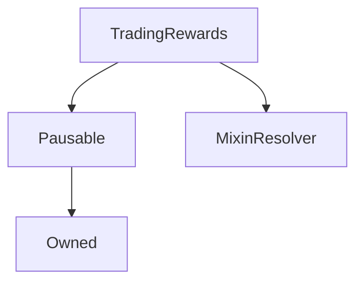

# TradingRewards

## Description

This contract is an implementation of [SIP-63](https://sips.synthetix.io/sips/sip-63). It records exchange fees paid by users into periods, which, when closed with a given amount of SNX rewards, allows participants to claim such rewards pro-rata, according to the amount of fees recorded for them in such period.

The recording of such fees can be enabled by the ProtocolDAO, via [SystemSettings](https://github.com/Synthetixio/synthetix/blob/v2.27.2/contracts/SystemSettings.sol#L129).

**Source:** [contracts/TradingRewards.sol](https://github.com/Synthetixio/synthetix/tree/v2.35.2/contracts/TradingRewards.sol)

## Architecture

### Libraries

- [SafeMath](/contracts/source/libraries/SafeMath) for `uint`
- [SafeDecimalMath](/contracts/source/libraries/SafeDecimalMath) for `uint`
- [SafeERC20](/contracts/source/libraries/SafeERC20) for `IERC20`

### Inheritance Graph

## Structs

### `Period`

[Source](https://github.com/Synthetixio/synthetix/tree/v2.35.2/contracts/TradingRewards.sol#L33)

| Field                       | Type                          | Description                                                                                                                |
| --------------------------- | ----------------------------- | -------------------------------------------------------------------------------------------------------------------------- |
| `isFinalized`               | `bool`                        | A period needs to be finalized for participants to be able to claim rewards.                                               |
| `recordedFees`              | `uint256`                     | Total recorded fees for the period.                                                                                        |
| `totalRewards`              | `uint256`                     | Total SNX rewards assigned to the period when it's closed.                                                                 |
| `availableRewards`          | `uint256`                     | Remaining SNX rewards after `totalRewards` have been assigned. Diminishes as participants claim their rewards.             |
| `unaccountedFeesForAccount` | `mapping(address => uint256)` | Records fees for each participant during the period. Increases when fees are recorded, decreases when rewards are claimed. |

## Constructor

### `constructor`

[Source](https://github.com/Synthetixio/synthetix/tree/v2.35.2/contracts/TradingRewards.sol#L50)

??? example "Details"

    **Signature**

    `(address owner, address periodController, address resolver)`

    **Visibility**

    `public`

    **State Mutability**

    `nonpayable`

    **Requires**

    * [require(..., Invalid period controller)](https://github.com/Synthetixio/synthetix/tree/v2.35.2/contracts/TradingRewards.sol#L55)

## Views

### `getAvailableRewards`

[Source](https://github.com/Synthetixio/synthetix/tree/v2.35.2/contracts/TradingRewards.sol#L76)

??? example "Details"

    **Signature**

    `getAvailableRewards() returns (uint256)`

    **Visibility**

    `external`

    **State Mutability**

    `view`

### `getAvailableRewardsForAccountForPeriod`

[Source](https://github.com/Synthetixio/synthetix/tree/v2.35.2/contracts/TradingRewards.sol#L120)

??? example "Details"

    **Signature**

    `getAvailableRewardsForAccountForPeriod(address account, uint256 periodID) returns (uint256)`

    **Visibility**

    `external`

    **State Mutability**

    `view`

### `getAvailableRewardsForAccountForPeriods`

[Source](https://github.com/Synthetixio/synthetix/tree/v2.35.2/contracts/TradingRewards.sol#L124)

??? example "Details"

    **Signature**

    `getAvailableRewardsForAccountForPeriods(address account, uint256[] periodIDs) returns (uint256)`

    **Visibility**

    `external`

    **State Mutability**

    `view`

### `getCurrentPeriod`

[Source](https://github.com/Synthetixio/synthetix/tree/v2.35.2/contracts/TradingRewards.sol#L92)

??? example "Details"

    **Signature**

    `getCurrentPeriod() returns (uint256)`

    **Visibility**

    `external`

    **State Mutability**

    `view`

### `getPeriodAvailableRewards`

[Source](https://github.com/Synthetixio/synthetix/tree/v2.35.2/contracts/TradingRewards.sol#L112)

??? example "Details"

    **Signature**

    `getPeriodAvailableRewards(uint256 periodID) returns (uint256)`

    **Visibility**

    `external`

    **State Mutability**

    `view`

### `getPeriodController`

[Source](https://github.com/Synthetixio/synthetix/tree/v2.35.2/contracts/TradingRewards.sol#L88)

??? example "Details"

    **Signature**

    `getPeriodController() returns (address)`

    **Visibility**

    `external`

    **State Mutability**

    `view`

### `getPeriodIsClaimable`

[Source](https://github.com/Synthetixio/synthetix/tree/v2.35.2/contracts/TradingRewards.sol#L96)

??? example "Details"

    **Signature**

    `getPeriodIsClaimable(uint256 periodID) returns (bool)`

    **Visibility**

    `external`

    **State Mutability**

    `view`

### `getPeriodIsFinalized`

[Source](https://github.com/Synthetixio/synthetix/tree/v2.35.2/contracts/TradingRewards.sol#L100)

??? example "Details"

    **Signature**

    `getPeriodIsFinalized(uint256 periodID) returns (bool)`

    **Visibility**

    `external`

    **State Mutability**

    `view`

### `getPeriodRecordedFees`

[Source](https://github.com/Synthetixio/synthetix/tree/v2.35.2/contracts/TradingRewards.sol#L104)

??? example "Details"

    **Signature**

    `getPeriodRecordedFees(uint256 periodID) returns (uint256)`

    **Visibility**

    `external`

    **State Mutability**

    `view`

### `getPeriodTotalRewards`

[Source](https://github.com/Synthetixio/synthetix/tree/v2.35.2/contracts/TradingRewards.sol#L108)

??? example "Details"

    **Signature**

    `getPeriodTotalRewards(uint256 periodID) returns (uint256)`

    **Visibility**

    `external`

    **State Mutability**

    `view`

### `getRewardsToken`

[Source](https://github.com/Synthetixio/synthetix/tree/v2.35.2/contracts/TradingRewards.sol#L84)

??? example "Details"

    **Signature**

    `getRewardsToken() returns (address)`

    **Visibility**

    `external`

    **State Mutability**

    `view`

### `getUnaccountedFeesForAccountForPeriod`

[Source](https://github.com/Synthetixio/synthetix/tree/v2.35.2/contracts/TradingRewards.sol#L116)

??? example "Details"

    **Signature**

    `getUnaccountedFeesForAccountForPeriod(address account, uint256 periodID) returns (uint256)`

    **Visibility**

    `external`

    **State Mutability**

    `view`

### `getUnassignedRewards`

[Source](https://github.com/Synthetixio/synthetix/tree/v2.35.2/contracts/TradingRewards.sol#L80)

??? example "Details"

    **Signature**

    `getUnassignedRewards() returns (uint256)`

    **Visibility**

    `external`

    **State Mutability**

    `view`

### `resolverAddressesRequired`

[Source](https://github.com/Synthetixio/synthetix/tree/v2.35.2/contracts/TradingRewards.sol#L62)

??? example "Details"

    **Signature**

    `resolverAddressesRequired() returns (bytes32[])`

    **Visibility**

    `public`

    **State Mutability**

    `view`

## Restricted Functions

### `closeCurrentPeriodWithRewards`

[Source](https://github.com/Synthetixio/synthetix/tree/v2.35.2/contracts/TradingRewards.sol#L196)

??? example "Details"

    **Signature**

    `closeCurrentPeriodWithRewards(uint256 rewards)`

    **Visibility**

    `external`

    **State Mutability**

    `nonpayable`

    **Requires**

    * [require(..., Insufficient free rewards)](https://github.com/Synthetixio/synthetix/tree/v2.35.2/contracts/TradingRewards.sol#L199)

    **Modifiers**

    * [onlyPeriodController](#onlyperiodcontroller)

    **Emits**

    * [PeriodFinalizedWithRewards](#periodfinalizedwithrewards)

    * [NewPeriodStarted](#newperiodstarted)

### `recordExchangeFeeForAccount`

[Source](https://github.com/Synthetixio/synthetix/tree/v2.35.2/contracts/TradingRewards.sol#L185)

??? example "Details"

    **Signature**

    `recordExchangeFeeForAccount(uint256 usdFeeAmount, address account)`

    **Visibility**

    `external`

    **State Mutability**

    `nonpayable`

    **Modifiers**

    * [onlyExchanger](#onlyexchanger)

    **Emits**

    * [ExchangeFeeRecorded](#exchangefeerecorded)

### `recoverAssignedRewardTokensAndDestroyPeriod`

[Source](https://github.com/Synthetixio/synthetix/tree/v2.35.2/contracts/TradingRewards.sol#L244)

??? example "Details"

    **Signature**

    `recoverAssignedRewardTokensAndDestroyPeriod(address recoverAddress, uint256 periodID)`

    **Visibility**

    `external`

    **State Mutability**

    `nonpayable`

    **Requires**

    * [require(..., Cannot recover from active)](https://github.com/Synthetixio/synthetix/tree/v2.35.2/contracts/TradingRewards.sol#L246)

    * [require(..., No rewards available to recover)](https://github.com/Synthetixio/synthetix/tree/v2.35.2/contracts/TradingRewards.sol#L249)

    **Modifiers**

    * [onlyOwner](#onlyowner)

    **Emits**

    * [AssignedRewardTokensRecovered](#assignedrewardtokensrecovered)

### `recoverTokens`

[Source](https://github.com/Synthetixio/synthetix/tree/v2.35.2/contracts/TradingRewards.sol#L216)

??? example "Details"

    **Signature**

    `recoverTokens(address tokenAddress, address recoverAddress)`

    **Visibility**

    `external`

    **State Mutability**

    `nonpayable`

    **Requires**

    * [require(..., Must use another function)](https://github.com/Synthetixio/synthetix/tree/v2.35.2/contracts/TradingRewards.sol#L218)

    * [require(..., No tokens to recover)](https://github.com/Synthetixio/synthetix/tree/v2.35.2/contracts/TradingRewards.sol#L223)

    **Modifiers**

    * [onlyOwner](#onlyowner)

    **Emits**

    * [TokensRecovered](#tokensrecovered)

### `recoverUnassignedRewardTokens`

[Source](https://github.com/Synthetixio/synthetix/tree/v2.35.2/contracts/TradingRewards.sol#L230)

??? example "Details"

    **Signature**

    `recoverUnassignedRewardTokens(address recoverAddress)`

    **Visibility**

    `external`

    **State Mutability**

    `nonpayable`

    **Requires**

    * [require(..., No tokens to recover)](https://github.com/Synthetixio/synthetix/tree/v2.35.2/contracts/TradingRewards.sol#L234)

    * [require(..., No tokens to recover)](https://github.com/Synthetixio/synthetix/tree/v2.35.2/contracts/TradingRewards.sol#L237)

    **Modifiers**

    * [onlyOwner](#onlyowner)

    **Emits**

    * [UnassignedRewardTokensRecovered](#unassignedrewardtokensrecovered)

### `setPeriodController`

[Source](https://github.com/Synthetixio/synthetix/tree/v2.35.2/contracts/TradingRewards.sol#L267)

??? example "Details"

    **Signature**

    `setPeriodController(address newPeriodController)`

    **Visibility**

    `external`

    **State Mutability**

    `nonpayable`

    **Requires**

    * [require(..., Invalid period controller)](https://github.com/Synthetixio/synthetix/tree/v2.35.2/contracts/TradingRewards.sol#L268)

    **Modifiers**

    * [onlyOwner](#onlyowner)

    **Emits**

    * [PeriodControllerChanged](#periodcontrollerchanged)

## Internal Functions

### `_calculateRewards`

[Source](https://github.com/Synthetixio/synthetix/tree/v2.35.2/contracts/TradingRewards.sol#L136)

??? example "Details"

    **Signature**

    `_calculateRewards(address account, uint256 periodID) returns (uint256)`

    **Visibility**

    `internal`

    **State Mutability**

    `view`

### `_claimRewards`

[Source](https://github.com/Synthetixio/synthetix/tree/v2.35.2/contracts/TradingRewards.sol#L166)

??? example "Details"

    **Signature**

    `_claimRewards(address account, uint256 periodID)`

    **Visibility**

    `internal`

    **State Mutability**

    `nonpayable`

    **Requires**

    * [require(..., Period is not finalized)](https://github.com/Synthetixio/synthetix/tree/v2.35.2/contracts/TradingRewards.sol#L168)

    * [require(..., No rewards available)](https://github.com/Synthetixio/synthetix/tree/v2.35.2/contracts/TradingRewards.sol#L171)

    **Emits**

    * [RewardsClaimed](#rewardsclaimed)

### `_validateRecoverAddress`

[Source](https://github.com/Synthetixio/synthetix/tree/v2.35.2/contracts/TradingRewards.sol#L261)

??? example "Details"

    **Signature**

    `_validateRecoverAddress(address recoverAddress)`

    **Visibility**

    `internal`

    **State Mutability**

    `view`

### `exchanger`

[Source](https://github.com/Synthetixio/synthetix/tree/v2.35.2/contracts/TradingRewards.sol#L72)

??? example "Details"

    **Signature**

    `exchanger() returns (contract IExchanger)`

    **Visibility**

    `internal`

    **State Mutability**

    `view`

### `synthetix`

[Source](https://github.com/Synthetixio/synthetix/tree/v2.35.2/contracts/TradingRewards.sol#L68)

??? example "Details"

    **Signature**

    `synthetix() returns (contract IERC20)`

    **Visibility**

    `internal`

    **State Mutability**

    `view`

## External Functions

### `claimRewardsForPeriod`

[Source](https://github.com/Synthetixio/synthetix/tree/v2.35.2/contracts/TradingRewards.sol#L153)

??? example "Details"

    **Signature**

    `claimRewardsForPeriod(uint256 periodID)`

    **Visibility**

    `external`

    **State Mutability**

    `nonpayable`

    **Modifiers**

    * [nonReentrant](#nonreentrant)

    * [notPaused](#notpaused)

### `claimRewardsForPeriods`

[Source](https://github.com/Synthetixio/synthetix/tree/v2.35.2/contracts/TradingRewards.sol#L157)

??? example "Details"

    **Signature**

    `claimRewardsForPeriods(uint256[] periodIDs)`

    **Visibility**

    `external`

    **State Mutability**

    `nonpayable`

    **Modifiers**

    * [nonReentrant](#nonreentrant)

    * [notPaused](#notpaused)

## Modifiers

### `onlyExchanger`

[Source](https://github.com/Synthetixio/synthetix/tree/v2.35.2/contracts/TradingRewards.sol#L282)

### `onlyPeriodController`

[Source](https://github.com/Synthetixio/synthetix/tree/v2.35.2/contracts/TradingRewards.sol#L277)

## Events

### `AssignedRewardTokensRecovered`

[Source](https://github.com/Synthetixio/synthetix/tree/v2.35.2/contracts/TradingRewards.sol#L295)

**Signature**: `AssignedRewardTokensRecovered(address recoverAddress, uint256 amount, uint256 periodID)`

### `ExchangeFeeRecorded`

[Source](https://github.com/Synthetixio/synthetix/tree/v2.35.2/contracts/TradingRewards.sol#L289)

**Signature**: `ExchangeFeeRecorded(address account, uint256 amount, uint256 periodID)`

### `NewPeriodStarted`

[Source](https://github.com/Synthetixio/synthetix/tree/v2.35.2/contracts/TradingRewards.sol#L291)

**Signature**: `NewPeriodStarted(uint256 periodID)`

### `PeriodControllerChanged`

[Source](https://github.com/Synthetixio/synthetix/tree/v2.35.2/contracts/TradingRewards.sol#L296)

**Signature**: `PeriodControllerChanged(address newPeriodController)`

### `PeriodFinalizedWithRewards`

[Source](https://github.com/Synthetixio/synthetix/tree/v2.35.2/contracts/TradingRewards.sol#L292)

**Signature**: `PeriodFinalizedWithRewards(uint256 periodID, uint256 rewards)`

### `RewardsClaimed`

[Source](https://github.com/Synthetixio/synthetix/tree/v2.35.2/contracts/TradingRewards.sol#L290)

**Signature**: `RewardsClaimed(address account, uint256 amount, uint256 periodID)`

### `TokensRecovered`

[Source](https://github.com/Synthetixio/synthetix/tree/v2.35.2/contracts/TradingRewards.sol#L293)

**Signature**: `TokensRecovered(address tokenAddress, address recoverAddress, uint256 amount)`

### `UnassignedRewardTokensRecovered`

[Source](https://github.com/Synthetixio/synthetix/tree/v2.35.2/contracts/TradingRewards.sol#L294)

**Signature**: `UnassignedRewardTokensRecovered(address recoverAddress, uint256 amount)`
