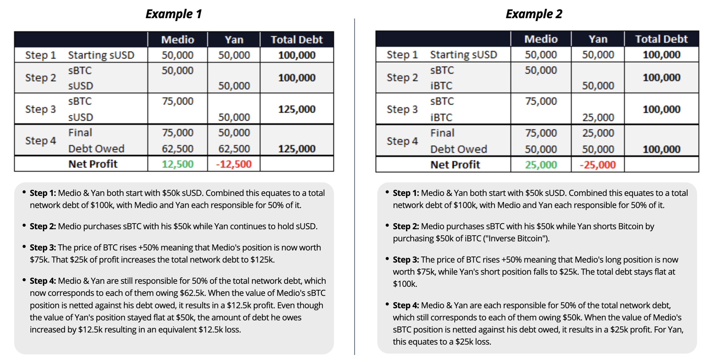

# 라이트 페이퍼

**버전**: 1.3 (2019년 12월 업데이트)

## 개요

Synthetix는 이더리움 기반의 신세틱 (합성) 자산 발행 프로토콜입니다. 발행된 신세틱 자산은 신세틱스 네트워크 토큰 (SNX)을 담보로 하고 있으며, 담보로 설정된 SNX 토큰은 스마트 컨트랙트를 통해 묶인 후 신세틱 자산 (“Synth”)이 발행됩니다. 이러한 담보 풀 모델은 사용자로 하여금 거래상대방 없이Synth를 스마트 컨트랙트를 통해 다른 Synth로 교환할 수 있게 합니다. 이러한 메커니즘은 탈중앙화 거래소 (DEX)에서 발생하는 유동성 및 거래 불이행 문제를 해결합니다. Synthetix는 현재 신세틱 법정화폐, 암호화폐 (롱 및 쇼트 포지션), 그리고 상품을 지원합니다. SNX 토큰 홀더는 보유하고 있는 토큰을 스테이킹하는 대가로 Synthetix.Exchange에서 발생하는 거래 수수료를 네트워크에 기여한 비율대로 받게 됩니다. 따라서 SNX 토큰의 가치는 Synth 거래에서 발생하는 수수료 양에 의해 정해지게 됩니다.

## 담보로 사용되는 SNX 토큰

**SNX가 Synth의 가치를 담보하는 방식**

모든 Synth는 SNX 토큰을 담보로 하고 있습니다. Synth는 SNX 토큰 홀더가 SNX를 Mintr를 통해 담보로 설정하면 발행되게 됩니다. Mintr은 Synthetix 컨트랙트와 상호작용을 하는 탈중앙화 어플리케이션입니다. 현재 Synth의 담보 비율은 750%로 설정되어 있습니다. 물론 이는 커뮤니티 거버넌스 메커니즘을 통해 추후 인상되거나 인하될 수 있습니다. 토큰 홀더는 SNX를 스테이킹하고 Synth를 발행함에 따라 채무를 발행하고, 예치한 SNX을 다시 받으려면 이전에 발행한 Synth 소각하여 해당 채무를 상환해야합니다.

**SNX 토큰 홀더가 스테이킹을 하는 이유**

SNX 토큰 홀더는 여러가지 이유로 보유하고 있는 토큰을 스테이킹하고 Synth를 발행을 하도록 장려됩니다. 먼저 거래 관련 보상이 있습니다. 이 보상은 특정 사용자가 Synthetix.Exchange를 통해 보유하고 있는 Synth를 다른 Synth로 교환할 때 발생합니다. 해당 거래로 발생하는 거래 수수료는 거래 수수료 풀로 보내지며, 이는 SNX를 스테이킹한 사용자가 일정비율로 매주 청구할 수 있게 됩니다. 거래 수수료율은 10에서 100BPS (0.1% - 1% 사이, 일반적으로 0.3%)로 설정되며 이는 Synthetix.Exchange의 거래 화면에 노출됩니다. SNX를 스테이킹 하게되는 또다른 이유는 인플레이션 정책을 기반으로 생성되는 스테이킹 보상을 받게 되기 때문입니다. 2019년 3월부터 2023년 8월까지 SNX의 총 발행량은 100,000,000개에서 260,263,816개로 늘어나며, 발행 속도는 2019년 12월부터 매주 1.25% 감소하게 됩니다. 2023년 9월부터는 고정적으로 연간 2.5%만큼 인플레이션이 발생하게 됩니다. 보상으로 발행된 SNX 토큰은 Synth의 담보 비율을 특정 수치 이상으로 유지한 SNX 토큰 보유자에게 정해진 비율로 주어집니다.

**발행, 소각 그리고 담보 비율**

위에 설명된 메커니즘은 SNX를 스테이킹한 토큰 보유자로 하여금 발행한 Synth의 담보 비율을 (C-Ratio)를 최적의 수치로 유지하게 합니다 (현재 750%).
이는 발행된 Synth로 하여금 큰 가격 변동이 발생했을 때에도 충분한 양의 담보가 해당 산을 뒷받침하기 위함입니다. SNX 토큰 및 Synth의 가치가 변하면, 사용자의 담보 비율 역시 변합니다. 작은 변동을 용납하게 만드는 소량의 버퍼를 시스템에 도입했지만, 만일 자산의 담보 비율이 750% 이하로 하락하면 자산을 발행한 사용자는 담보 비율을 기존 수치로 회복하지 않는 이상 시스템에서 발생하는 수수료에 대한 청구권을 잃게 됩니다. 사용자는 담보 비율이 750%가 넘으면 추가로 Synth를 발행하고, 750% 이하로 떨어지면 Synth를 소각하여 최적의 담보 비율인 750% 유지할 수 있습니다.

**스테이킹 참여자, 채무 그리고 통합된 거래상대방**

SNX의 스테이킹 참여자가 Synth를 발행할 때 채무가 발행됩니다. 해당 채무는 발행 당시의 가치와 관계없이 네트워크 내의 Synth 공급량과 환율에 따라 상승하거나 하락할 수 있습니다. 예를 들어, 시스템 상에 발행된 모든 Synth가 신세틱 비트코인 (sBTC)이라 가정하고 비트코인 가격이 50% 하락할 경우, 시스템 상의 전체 채무 역시 반으로 줄며, 각 스테이킹 참여자의 채무 역시 반으로 감소하게 됩니다. 그러나 전체 Synth의 50%만이 sBTC의 경우, BTC 가격이 두배 올랐을 때, 시스템 상의 전체 채무와 각 스테이킹 참여자의 채무는 25%밖에 상승하지 않습니다.
이러한 방식으로 인해 SNX 스테이킹 참여자는 모든 Synth 거래에 있어 통합된 (Pooled) 거래상대방으로 참여하게 됩니다; 스테이킹 참여자는 시스템 상에서 발행된 총 채무에 대한 위험만 감수하게 됩니다. 이는 참여자로 하여금 시스템 외부에서 특정 포지션을 취해 리스크를 헷징 할 수 있습니다. Synthetix.Exchange에서 거래를 발생시킬 수 있는 환경을 조성함에 따라 스테이킹 참여자는 시스템 상에서 발생하는 거래 수수료를 보상으로 받을 수 있습니다.

_Synthetix Network 상에서 채무 작용방식에 대한 예시_

## Synth 페깅 메커니즘

거래 참여자는 수익을 창출하기 위해서 Synth와 다른 암호자산 교환에 있어 유동성과 가격 안정성을 요구하기 때문에, Synth 페깅은 시스템에 필수적인 요소입니다. 특정 Synth는 오픈 마켓에서 거래되기 때문에, 해당 자산의 실제가격은 액면가를 하회할 수 있습니다. 따라서 자산의 가격과 액면가의 편차를 최소화하고 이를 조정할 수 있는 장려책이 필요합니다.

Synthetix Network는 Synth 페깅을 유지하기 위한 세가지 방법을 도입했습니다:

- **차익거래**: SNX 스테이킹 참여자는 Synth를 발행함에 따라 채무를 발생시킵니다. 만일 sUSD와 USD가 1:1 비율로 페깅 되어야함에도 불구하고, 페깅 비율이 하락하면 사용자는 sUSD를 액면가 아래에서 구매하고 채무를 상환하여 수익을 발생시킬 수 있습니다.
- **Uniswap상의 sETH 유동성 풀**: 인플레이션 정책을 의해 새로 발행된 SNX 토큰은 Uniswap의sETH/ETH 풀에 유동성을 제공하는 참여자에게 보상으로 주어집니다. 따라서 유동성 제공자는 해당 풀에 다른 참여자와 함께 높은 유동성을 제공하도록 장려되며, 이를 통해 거래 참여자는 Synth를 거래하여 수익을 창출할 수 있게 됩니다.
- **SNX 차익거래 컨트랙트**: 당사는 Uniswap상의 sETH/ETH 비율이 99:100 이하로 떨어졌을 경우, 사용자로 하여금 ETH를 SNX를 홀딩하고 있는 컨트랙트로 전송할 수 있도록 컨트랙트를 설계했습니다. 사용자는 보낸 ETH는 sETH/ETH Uniswap 풀을 통해 액면가로 SNX 토큰과 교환할 수 있습니다. 따라서 sETH 비율이 특정 수치 이상으로 하락하면 사용자는 해당 컨트렉트를 통해 할인된 가격으로 ETH를 SNX로 교환할 수 있게 됩니다. 이러한 이유 때문에 새로 발행된 SNX 토큰의 일정량은 해당 컨트렉트로 보내지게 됩니다.

## Synthetix.Exchange

**신세틱 자산을 거래하는 이유**

신세틱 자산은 사용자로 하여금 기초 자산을 보유하지 않아도 해당 자산의 익스포져를 확보할 수 있게합니다. 이는 여러가지 장점이 있는데, 그 중 하나는 보유하고 있는 자산을 타 자산으로 교환할 때 발생하는 마찰을 최소화하고 (예: Apple 주식을synthetic 금으로 교환할 경우), 특정 자산에 대한 접근성과 검열 저항을 높입니다.

**Synthetix.Exchange의 장점**

Synthetix.Exchange는 중앙화 된 거래소와 오더북 기반의 탈중앙화 거래소와 비교하였을 때 여러 장점을 가지고 있습니다. Synthetix.Exchange는 오더북 구조를 가지고 있지 않기 때문에 모든 거래는 P2C (peer-to-contract)로 지칭되는 컨트랙트 기반으로 이루어집니다. 모든 자산에게는 외부 오라클이 제공하는 가격 피드를 바탕으로 정해지는 교환 비율 (exchange rate)이 정해지며, 해당 자산은 Synthetix.Exchange dApp을 통해 다른 자산으로 교환될 수 있습니다. 따라서 Synthetix.Exchange는 시스템이 확보한 총 담보 가치만큼의 유동성을 가지게 되며, 계약 불이행의 여지를 완전히 제거하고, 온체인상에서 비허가형 방식으로 거래를 채결할 수 있게 합니다.

**Synth 작동원리**

Synth는 기초자산의 가격을 트래킹하는 합성 자산입니다. 이는 홀더로 하여금 다양한 기초자산을 보유하지 않고서도 해당 자산에 대한 익스포져를 이더리움 블록체인 상에서 누릴 수 있게 합니다. 모든 Synth는 SNX 토큰을 담보로 하고 있으며, 담보 비율은 750%를 유지하도록 설정되어 있습니다.

**Synth 분류 방식**

현재 Synth는 법정화폐, 상품, 암호화폐 및 인버스 암호화폐, 4가지로 분류됩니다. 현재 시스템은 sUSD, sEUR, sKRW외에도 여러 법정화폐 기반의 Synth를 지원하고 있으며, 상품 관련해서는 금과 은을 온스 기준으로 지원하고 있습니다. 또한 암호화폐로는 sBTC, sETH, sBNB를 제공하고 있으며 앞으로 더 많은 암호화폐 기반의 Synth가 추가될 예정입니다. 인버스 암호화폐 Synth는 역비례 방식으로 기초 자산을 트래킹합니다. 예를들어 BTC가격이 하락하게 되면, iBTC의 가격은 상승하게 됩니다.

## 시스템 아키텍처

**Synth 발행**

SNX 토큰 홀더는 Synthetix 스마트 컨트랙트를 통해 보유하고 있는 SNX 토큰을 담보로 설정하여 Synth를 발행할 수 있습니다. 발행 과정은 다음과 같습니다:

- Synthetix 스마트 컨트랙트는 토큰 홀더가 SNX를 스테이킹하여 Synth를 발행할 수 있는지에 대한 여부를 750% 담보 비율 조건을 기반으로 확인합니다.
- 스테이킹 참여자의 채무는 채무 장부 (Debt Register)에 기록됩니다. 해당 채무의 값은 발행 시점의 Synth의 가치와 동일하며 XDR (Synthetix Drawing Rights) 방식으로 저장됩니다. XDR은 채무의 가치를 안정시키기 위해 IMF의 특별인출권 (Special Drawing Right)과 같이 여러 화폐로 구성되어 있는 바스켓을 사용합니다. 바스켓에 선정된 화폐의 가격은 가격 오라클을 통해 온체인상에 지속적으로 실시간 업데이트 됩니다.
- 스테이킹 참여자의 채무를 바탕으로 Synthetix의 스마트 컨트랙트는 각각의 Synth 컨트랙트로 하여금 새로운 Synth를 발행하게 하며, 새로 발행된 Synth는 사용자의 지갑에 추가됩니다.

만일 SNX 토큰 가격이 상승할 경우, 상승한 양만큼의 담보로 설정된 SNX 토큰이 해제되어 스테이킹 참여자에게 환불됩니다. 예를 들어 사용자가 $100만큼의 SNX 토큰을 담보로 설정했다고 가정했을 때, SNX의 가격이 2배가 될 경우, 사용자는 담보로 예치된 SNX 토큰의 50%를 (총 담보 가치는 $200) 돌려받습니다. 사용자가 원할 경우, 풀린 SNX 토큰을 다시 담보로 설정하여 추가로 Synth를 발행할 수 있습니다.

**거래**

Synth가 타 Synth로 교환할 될 때 아래의 과정을 거치게 됩니다 (예시: sUSD를 sBTC로 교환):

- 보유하고 있는 기초 Synth를 소각 (sUSD)함에 따라 사용자의 sUSD 잔고를 줄이고 시스템 상의 총 sUSD 발행량이 역시 조정됩니다.
- 총 교환되는 자산의 값이 설정됩니다 (각 자산의 현재 가치를 기반으로 환율 설정).
- 교환되는 자산의 0.3%에 해당하는 거래 수수료가 발생하고 해당 수수료는 XDR 구조로 수수료 풀에 보내집니다. 해당 수수료는 추후 SNX 스테이킹 참여자가 시스템 참여보상으로 청구할 수 있습니다.
- 수수료를 제외한 99.7%의 자산은 사용자가 원하는 Synth (sBTC) 컨트랙트를 통해 sBTC 발행에 사용되며, 사용자 지갑의 sBTC 잔고는 이를 반영합니다.
- 시스템 상의 총 sBTC 발행량 역시 업데이트 됩니다.

이러한 방식으로 시스템이 특정 Synth를 다른 Synth로 교환함에 따라 거래에 거래상대방이 필요 없습니다. 따라서 오더북 및 오더북 매칭 역시 필요 없으며, Synth 사이에서 무한한 유동성이 확보됩니다. 또한 SNX 토큰 기준으로 소각된 Synth와 동일할 양의 Synth가 새로 발행되기 때문에 채무 풀의 총 채무 규모 역시 변동되지 않습니다.

**거래 수수료 청구**

Synthetix 컨트랙트를 통해 특정 Synth가 다른 Synth로 교환될 경우, 0.3%의 거래 수수료가 발생하여 거래 수수료 풀에 XDR 구조로 전송됩니다. 해당 수수료는 추후 SNX 스테이킹 참여자가 청구하여 가져갈 수 있습니다. 사용자가 해당 수수료 (Synth 거래 보상)를 청구할 때 SNX 스테이킹 보상 역시 청구하게 됩니다. 따라서 스테이킹 참여자는 SNX를 스테이킹하여 추가로 SNX를 보상으로 받게 됩니다. 스테이킹 참여자가 수수료를 청구하였을 때 다음과 같은 과정이 발생합니다:

- 수수료 풀은 풀에 충분한 거래 수수료가 있는지 확인하고 수수료를 보상으로 청구한 참여자가 수수료를 받을 자격이 있는지 확인합니다.
- 참여자가 청구한 규모만큼의 XDR로 되어있는 수수료가 소각되고 동일한 규모의 sUSD가 새로 발행되어 참여자에게 주어집니다. 사용자의 지갑 잔고와 거래 수수료 풀의 잔고가 이를 바탕으로 업데이트 됩니다.
- 또한 인플레이션 정책에 의해 새로 발행된 SNX 토큰의 일정량은 SNX 스테이킹 보상으로 참여자에게 추가로 지급됩니다.

거래 수수료는 각 총 채무 대비 스테이킹 참여자가 발행한 채무 비율 바탕으로 분배됩니다. 예를 들어, 한 참여자가 1,000 sUSD를 발행하였고 총 채무 풀에는 \$10,000 sUSD가 발행되고 100 sUSD만큼의 거래 수수료가 발생하였을 때 참여자는 10 sUSD의 거래 수수료를 보상으로 받을 수 있게 됩니다. 이는 참여자가 총 채무 풀에 10%에 해당하는 채무를 발행하였기 때문입니다. SNX 스테이킹 보상 역시 동일한 방식으로 분배됩니다.

**채무 소각**

SNX 스테이킹 사용자가 네트워크 참여를 중단하거나 담보로 예치한 SNX 토큰을 환불 받고 싶을 경우, 채무를 상환해야합니다. 간단한 예로, 참여자가 SNX 토큰을 예치하여 10 sUSD를 발행했을 경우, 예치한 토큰을 전부 반환 받기 위해서는 10 sUSD를 소각해야 합니다. 그러나 총 채무 풀의 규모가 바뀔 경우 (따라서 각 개인의 채무 규모가 변할 경우), 참여자는 발행할 당시의 채무보다 추가로 혹은 적은 값의 채무를 상환하여 SNX 토큰을 되돌려 받을 수 있습니다. 참여자가 모든 채무를 상환하기 원할 경우 다음과 같은 과정이 거치게 됩니다:

- Synthetix 컨트랙트가 사용자의 채무 잔고를 확인하고 채무 상환을 채무 장부에 기록합니다.
- 채무 상환에 필요한 만큼의 sUSD가 소각되며, 사용자 sUSD 지갑 잔고와 시스템의 총 sUSD 발행량이 업데이트 됩니다.
- 예치된 SNX 토큰은 해제되어 거래 가능하게 됩니다.

**채무 풀**

SNX 토큰 홀더가 Synth를 발행하거나 소각할 때마다, Synthetix 시스템은 지속적으로 전체 채무 풀과 개인의 채무 값을 트래킹합니다. 시스템은 이를 총 누적 채무 델타 비율 (Cumulative Debt Delta Ratio) 기반으로 업데이트하게 됩니다. 해당 비율은 참여자의 채무가 발행 혹은 상환될 시점의 참여자 개인 채무가 전체 채무 풀에서 차지하는 비율과 다른 참여자가 스테이킹에 참여하거나 담보를 회수함으로 인해 발생하는 변화를 측정합니다. 시스템은 해당 정보를 바탕으로 모든 사용자의 채무 규모 변화를 지속적으로 기록하지 않아도 각 참여자의 재무 규모를 계산할 수 있습니다.

시스템은 채무 장부 상에서 누적 채무 델타 비율을 추적하여 모든 사용자의 전체 채무 대비 개인 채무 비율을 계산할 수 있습니다. 시스템은 새로 발행된 채무가 전체 풀에 발생시킨 비율 변화를 아래의 공식을 사용하여 계산하고 채무 장부를 업데이트합니다.

`새로 발행한 채무 ÷ (기존에 총 채무 + 새로 발행된 채무)`

참여자가 가장 최근에 진행한 발행/소각은 이후 채무 장부에 채무 발행 데이터와 발행/소각 당시의 관련 인덱스와 함께 기록됩니다. 장부에 기록되는 주요 데이터는 해당 참여자의 개인 채무가 전체 채무 풀에서 차지하는 비율이며, 이는 아래의 공식을 바탕으로 계산됩니다.

`참여자의 채무 비율 = (새로 발행한 채무 + 기존의 개인 채무) ÷ (기존의 총 채무 + 새로 발행된 채무)`

채무 장부는 위의 공식들을 바탕으로 계산된 누적 채무 델타 비율을 기록하며, 채무가 발행된 시간 역시 기록됩니다. 채무 장부는 해당 기록들과 총 채무 풀에 발생한 값 변화를 바탕으로 사용자의 전체 채무 풀 대비 개인채무 비율을 예측할 수 있게 됩니다.

이후 시스템은 각 Synth 컨트랙트에 묶여있는 토큰의 숫자와 새로운 채무가 발행 혹은 소각 되었을 시점의 환율을 곱하여 총 채무 풀 값을 재계산하게 됩니다.

`총 발행된 채무 = 총 발행된 Synth 규모 (“XDR”)`

이를 통해 현재 채무 풀의 규모를 측정하고 이를 누적 채무 델타 비율에 계산에 사용하여 채무 장부에 등록되는 채무의 규모를 Synth 기준으로 알 수 있게 됩니다.

아래는 사용자가 채무를 새로 발행할 때 사용되는 역계산을 요약한 내용입니다.

`사용자의 총 채무 대비 개인 채무 비율 = (기존의 개인 채무 – 소각할 채무) ÷ (총 채무 – 소각할 채무)`

아래는 누적 채무 델타를 계산하는데 사용되는 공식입니다.

`델타 = 소각할 채무 ÷ (총 채무 – 소각할 채무)`

만일 참여자가 모든 채무를 소각할 경우, 채무 장부상의 발행 데이터는 0으로 설정되며, 참여는 더 이상 채무 풀에 참여하지 않게 됩니다.

**오라클**

Synthetix 시스템 내의 모든 신세틱 자산의 가치는 온체인 상으로 가격 피드를 전송하는 오라클에 의해 정해집니다 (컨트랙트 정보). 오라클은 다양한 소스로부터의 정보와 특정 알고리즘을 기반으로 각 자산의 종합적인 가치를 정하게 됩니다. 해당 오라클은 현재 Synthetix 재단이 운영하지만 추후 탈중앙화 방식으로 운영될 예정입니다.

## 현존하는 리스크와 대처 방안

**리스크**

현재 Synthetix는 실증적인 관찰과 이론적인 분석이 필요한 아직 실험적이고 복잡한 시스템으로 몇 가지 리스크가 존재합니다. 실증적이 관찰과 이론적인 분석을 통해 모든 참여자들의 이해관계가 일치할 수 있도록 메커니즘을 구축할 계획입니다.

우선, SNX 토큰 홀더가 SNX 토큰을 담보로 예치하고 Synth를 발행하였을 때 채무 관련 리스크가 발생합니다. 이전에 설명했듯이, 홀더가 발행한 채무의 가치는 시스템 내의 환율에 따라 변동하게 됩니다. 따라서 만일 참여자가 스테이킹 멈추고 네트워크 참여 중지를 원할 경우, 처음에 발행한 규모 이상의 Synth를 소각해야 할 수 있습니다.
암호화폐 산업의 많은 참여자는 이러한 리스크를 인지하고 있습니다. 그러나 대다수의 암호화폐의 가격은 비트코인과 이더리움의 가격과 높은 상관관계를 가지고 있습니다. 따라서 SNX와 Synthetix 시스템과 관계없이 SNX 토큰의 높은 가격 변동이 발생할 수 있습니다.

마지막으로 시스템의 몇 가지 부분은 중앙화 되어있습니다. 이는 시스템을 효율적으로 도입하기 위해서 재단에서 내린 결정 때문입니다. 예를 들어 시스템은 구조상 프록시 컨트랙트를 사용하고 있습니다. 이는 재단으로 하여금 쉽게 시스템을 업그레이드 할 수 있게 함이지만 상당한 권한을 재단측에 부여하게 되어 사용자의 신뢰를 요구하게 되는 구조입니다. 앞으로 이러한 리스크는 점점 완화될 예정이지만, 투자자 및 참여자는 현재 시스템 구조상 존재하는 리스크를 충분히 이해할 필요가 있습니다.

**대처 방안**

탈중앙화 프로토콜로써, Synthetix 팀은 탈중앙화와 검열 저항에 전념할 계획입니다. 이는 점진적인 과정을 통해 시스템이 성숙되면서 달성될 예정입니다. 탈중앙화는 가격 피드을 포함한 여러 중요한 분야에서 이루어질 것입니다. 당사는 이전에 탈중앙화 오라클 솔루션 제공자인 체인링크 (ChainLink) 파트너쉽을 발표하였고 현재 sepolia 테스트넷에서 연동이 완료된 상태입니다.

또 다른 중요 분야는 거버넌스입니다. 최근 당사는 커뮤니티 거버넌스 콜을 진행하여 재단의 목표가 커뮤니티와 목표와 일치될 수 있도록 노력하고 있습니다. 또한 운영 프로세스와 관련하여 SIP (Synthetix Improvement Proposal) 를 도입하였습니다. 이를 통해 커뮤니티가 변경점을 제안하거나 시스템에서 일어나는 모든 변경점이 모든 이해관계자가 고려하고 이해할 수 있게 만들 계획입니다.

## 추가 예정인 기능 소개

**Synth 추가**

Synthetix.Exchange의 범용성을 개선하기 위해 더 많은 종류의 Synth를 시스템에 추가할 수 있습니다. 이는 다른 플랫폼에 제공되지 않는 레버러지 자산뿐만 아니라 S&P500과 같은 인덱스 상품과 AAPL 및 TSLA 같은 전통 주식이 있습니다.

**신세틱 포지션**

추후에 당사는 Synthetix.Exchange에서 거래자가 신세틱 포지션을 보유할 수 있도록 기능을 추가할 예정입니다. 해당 기능의 많은 부분이 아직 확정되지 않았지만, Uniswap의 자동 마켓 메이커 알고리즘 (auto market maker algorithm)과 같은 셀프 밸런싱 메커니즘을 사용할 것으로 보입니다. 또한 시스템은 거래 수수료의 일부를 리스크 밸런싱을 하는 거래자에게 지불하도록 설계하여 거래자로 하여금 지속적으로 리스크를 관리하도록 장려할 예정입니다. 해당 기능은 초기 단계에 도입되지 않을 것입니다.

현재 암호화폐 관련 파생상품을 지원하는 여러 거래 플랫폼이 존재합니다. 그러나 기존의 모든 플랫폼은 거래상대방에 의존하는 유동성에 의해 제한되어 있습니다. 따라서 거래 상대방에 의존하지 않는 Synthetix 시스템의 독특한 구조로 통해, Binance가 타 거래소보다 더 많은 암호화폐를 상장하여 시장 점유율을 확보한 방식과 유사하게 시장 점유율을 확보할 수 있을 것으로 보입니다.

**ETH 담보 기능**

Synthetix 커뮤니티의 몇 사용자가 재단에 플랫폼의 활성화를 위하여 이더리움을 담보로 활용할 수 있는 기능을 추가하자는 제안을 했습니다. 따라서 재단은 SNX 토큰의 가치에 부정적인 영향을 끼치지 않는 선에서 사용자가 이더리움을 담보로 예치할 수 있는 독특한 메커니즘을 도입할 방법을 찾고 있습니다.

**대출**

이더리움 네트워크 상에서 DeFi에 대한 수요가 꾸준히 상승하고 있으며 Synthetix 재단은 이를 지지합니다. 또한 비수탁형 대출이 생태계에 중요한 부분을 차지할 것으로 보고 있습니다. 따라서 당사는 사용자가 Synth를 빌리고 Synthetix.Exchange에서 거래할 수 있도록 여러 오픈소스 대출 프로토콜과 연동하여 sUSD 대출기능을 제공할 계획입니다.

## 결론

Synthetix는 이미 현존하는 이더리움 기반의 프로토콜 중에서 가장 복잡하고 유용한 프로토콜입니다. 그러나 검열 저항적인 합성 자산의 잠재력은 아직 충분히 확인되지 않은 것으로 보입니다. 따라서 지속적인 메커니즘 개선과 새로운 기능 및 Synth 추가는 플랫폼의 활용도를 상당하게 발전시킬 수 있을 것입니다. 또한 앞으로 탈중앙화 거버넌스 구조를 확립함으로 시스템의 체계적 위험을 줄이고 프로젝트의 장기적인 실행 가능성 역시 개선 될 것입니다.
